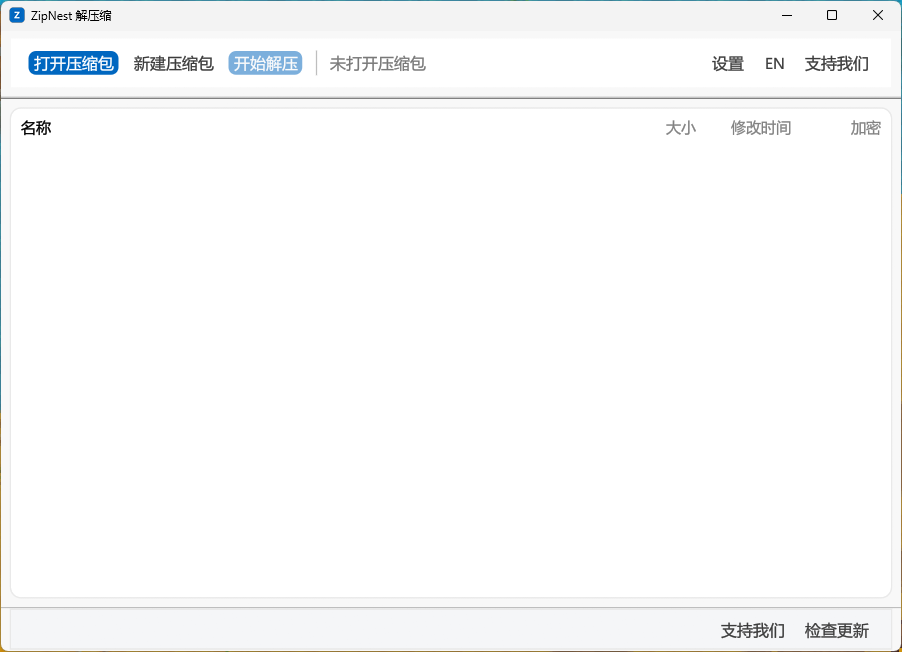
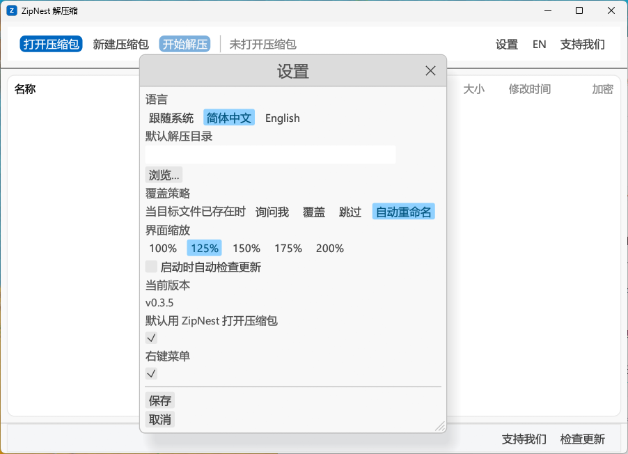

# ZipNest 解压缩

**免费、开源、无广告的 Windows 解压缩软件。原生界面，零运行时依赖，安装包只有 3.6 MB。**

[](https://github.com/CN6/zipnest/releases/latest)
[](LICENSE)
[](#下载)
[](#下载)

双击压缩包直接打开，就像系统自带的功能一样自然。底层是官方 7-Zip 引擎（`7z.dll` 运行时动态加载），ZIP / 7z / RAR / TAR / GZ / BZ2 / XZ / ISO 一个不落。**全部功能免费，没有任何功能被锁定。**

## 界面预览

<p align="center">
  
</p>
<p align="center"><sub>主界面（深色模式）—— 顶部「打开压缩包 / 新建压缩包」，文件列表按名称、大小、修改时间对齐排列</sub></p>

<p align="center">
  
</p>
<p align="center"><sub>设置 —— 语言、外观（跟随系统 / 浅色 / 深色）、界面缩放、默认解压目录、覆盖策略、系统集成</sub></p>

## 你可能受够了这些

| 常见的糟心事 | ZipNest 的做法 |
| --- | --- |
| 弹广告、催你买会员、免费版锁功能 | **完全免费、全功能开放**，只有一个自愿的捐赠入口 |
| 装完还要再装 WebView2 / .NET / VC++ 运行库 | **零运行时依赖**，装完直接能用 |
| 后台常驻进程、开机自启、悄悄联网 | **零残留进程**，无遥测，日志只存在本地 |
| 界面卡、启动慢、内存占用高 | Rust + egui **原生界面**，安装包 **3.6 MB**，点开就用 |
| 纯白界面晚上看着刺眼，还不跟随系统 | **深色模式**，跟随系统或手动切换 |
| 每次打开都是固定的小窗口，位置还得重摆 | **记住窗口大小和位置** |
| 点几次就开几个窗口，关都关不完 | **窗口会自己收拾**：没在解压就复用旧窗口，正在解压才另开一个，跑完自动关闭 |
| 解压完文件散落一地，还得自己整理 | 默认解到 `<压缩包所在目录>\<压缩包名>\`，自动建好文件夹 |
| 压缩包里有怪文件名，解压到一半失败还丢文件 | 跳过个别不安全条目**继续解压**，不再整体中止 |

> 不装浏览器内核、不装 .NET、不装运行库。双击安装，立刻能用。

## 下载

到 [Releases 页面](https://github.com/CN6/zipnest/releases/latest) 下载最新版（当前 **v0.4.14**）：

| 版本 | 文件 | 大小 | 说明 |
| --- | --- | --- | --- |
| **安装版（推荐）** | `ZipNest_0.4.14_x64-setup.exe` | 3.7 MB | 双击安装，注册右键菜单、**并自动设为压缩包默认打开程序**；装完可勾选是否创建桌面快捷方式 |
| 便携版 | `ZipNest_0.4.14_x64_portable.zip` | 4.8 MB | 解压即用、免安装，放 U 盘带走也行（首次打开时自动设为默认） |

> 仅支持 **Windows 10 / 11（x64）**。完整改动记录见 [CHANGELOG](CHANGELOG.md)。

## 功能

**解压** —— ZIP、7z、RAR、TAR、GZ、BZ2、XZ、ISO 全支持；浏览归档内容、按需只解压选中文件、拖拽打开。

**创建** —— ZIP / 7Z / TAR（含 `.tar.gz` / `.tar.bz2` / `.tar.xz`），可设压缩等级与方法。

**安全** —— AES-256 加密、7z 文件名加密、分卷压缩、7z 自解压（SFX）打包。

**集成** ——
- **安装 / 首次启动自动把 9 个压缩包格式设为 ZipNest 打开**（ZIP / 7Z / RAR / TAR / GZ / TGZ / BZ2 / XZ / ISO），无需手动设置
- **被别的程序抢走的格式也能一键改回来**：设置 → 系统集成 →「设为默认解压软件」。点一下立刻生效，不用去系统「默认应用」里翻页、不用确认、不用重启（Bandizip / WinRAR / 系统自带占着 `.zip` 也一样能改）
- 系统仍保留你的选择权：之后你在「打开方式」里换成别的程序，ZipNest 不会偷偷改回去
- 文件夹右键菜单一键解压
- Windows 11 新版右键菜单「添加到压缩包…」（直接出现在一级菜单，不用点"显示更多选项"）
- 把文件或文件夹拖进窗口即可打包
- 解压默认解到 `<压缩包所在目录>\<压缩包名>\`，自动建好文件夹，文件不散落

**外观** ——
- **深色模式**：跟随系统，或手动选浅色 / 深色
- 记住窗口大小与位置，下次打开还在原处
- 文件列表按名称 / 大小 / 修改时间分列对齐，隔行底纹、悬停高亮
- 界面缩放 100%–200%，中英双语

**其它** —— 内置文本 / 图片 / 十六进制预览、实时进度条（百分比 / 速度 / 可取消）、对话框支持回车确定与 Esc 取消、解压失败明确提示、**设置里一键复制诊断信息并邮件反馈问题**（不含任何文件名或个人内容）。

## 使用方式

打开软件 → 打开或拖入一个压缩包 → 左侧浏览文件 → 选中条目右侧预览 → 一键解压。就这么简单。

## 支持我们

ZipNest 完全免费，没有任何功能被锁，也没有广告和会员。如果它帮你省了时间，欢迎请作者喝杯咖啡 —— **完全自愿，不捐也照样能用全部功能**。

<!-- 收款码与软件内「设置 → 支持我们」用的是同一对图片 -->
<p align="center">
  <a href="apps/zipnest-native/src/assets/donate/wechat.jpg"></a>
  &nbsp;&nbsp;&nbsp;&nbsp;
  <a href="apps/zipnest-native/src/assets/donate/alipay.jpg"></a>
</p>

<p align="center"><sub>左：微信 &nbsp;·&nbsp; 右：支付宝 &nbsp;（点图片可看大图，手机端可长按识别）</sub></p>

也可以在软件里捐：打开 ZipNest → **设置 →「支持我们」**。

## 反馈

遇到 bug、有功能建议，或者想催更，都欢迎到 [Issues](https://github.com/CN6/zipnest/issues) 提 —— 提之前可以先搜一下，避免重复。

反馈时请带上 ZipNest 的版本号（设置页可以看到）和你的 Windows 版本，能省不少来回。

## 开发

```powershell
cargo test --workspace            # Rust 单元/集成测试
cargo run -p zipnest-native       # 开发运行（原生界面）
cargo build -p zipnest-native --release
```

## 许可

- 本项目代码：**MIT**（见 `LICENSE`）
- `7z.dll` 为官方未修改的 7-Zip 二进制（LGPL），运行时动态加载、不做静态链接；其许可随安装包附带（`licenses/7zip.txt`）
- `vendor/7zip-sdk` 头文件来自 7-Zip SDK（LGPL），见 https://www.7-zip.org/
